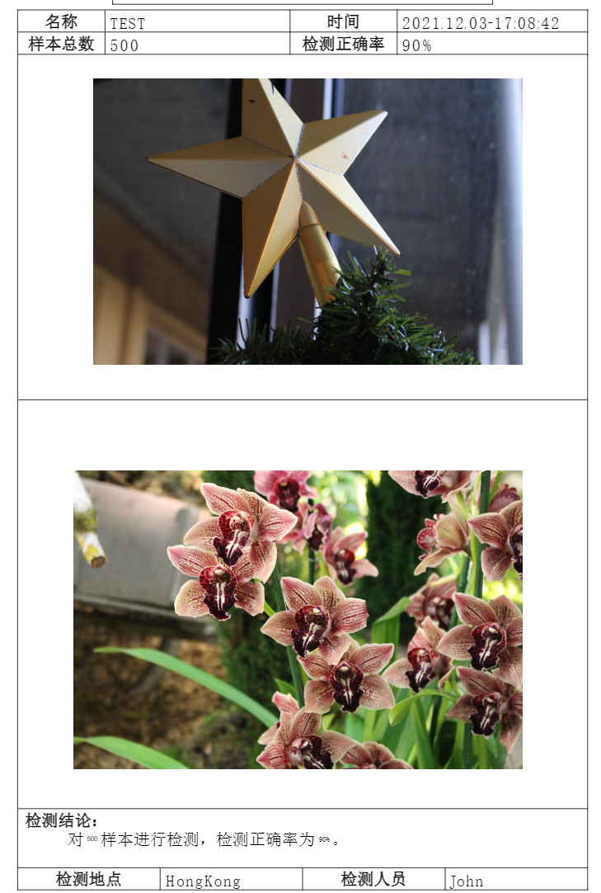

## Introduction
The method of using java to generate PDF:
- itext-PdfStamper pdfStamper (commonly known as the pdf template)
 itext-Document document (normal writing XML/HTML code to generate pdf) 
## Folder Structure
The workspace contains two folders by default, where:
- `src`: the folder to maintain sources
- `lib`: the folder to maintain dependencies
Meanwhile, the compiled output files will be generated in the `bin` folder by default.
## Experimental Result
- itext-PdfStamper pdfStamper

